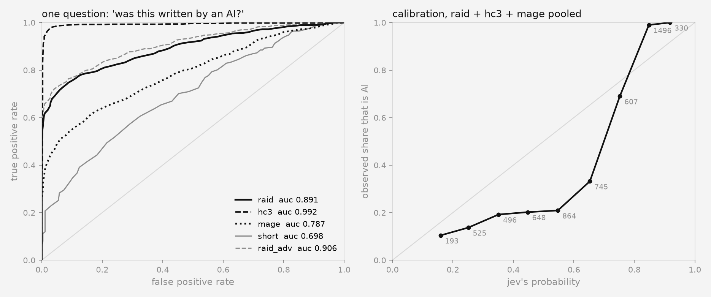

# Can Jev do what Pangram does?

Measured 2026-09-21 on 7,139 texts from three public benchmarks. Every number here is produced by
`score.py` from `data/predictions.parquet`; the tables regenerate with `python3 score.py`.

**Short answer: no, not at Pangram's operating point.** Jev separates AI from human text well enough
to be useful as a ranker — 0.89 AUC on RAID, 0.99 on HC3, 0.79 on MAGE, zero training, one API call
per text, $0.97 for the whole study. It is not close to a detector you could put in front of a
student essay: at a 1% false-positive rate it catches 62% of RAID's AI text, where Pangram publishes
a 0.34% miss rate at a 0.004% false-positive rate. The gap is two orders of magnitude in the place
that matters.

## What was asked

One request per text, 28 typed questions evaluated in parallel against the same state: the direct
question, four other phrasings of it, and 19 speculative style questions (generic register, hedging,
listiness, absence of specifics, uniform rhythm, clean mechanics, lived experience, typos, stake…).
Batching is what makes the fan-out free — the text is sent once.

- `ai` — Noul: *"This text was written by an AI language model (such as ChatGPT, Claude, Llama or
  GPT-4), rather than written by a human being."* This is the headline number.
- `ens` — the unweighted mean of four phrasings (`ai`, the editor Noul, the rich Choice, the 5-level
  Score ÷ 4). Nothing fitted.
- `combo` — logistic regression on the 19 style Nouls, fitted on RAID, reported both 5-fold
  cross-validated in-set and transferred to the other sets.
- Threshold `J` = 0.67, the Youden point on RAID, then applied unchanged everywhere. Accuracies at a
  threshold are all at that one threshold, because that is the honest way to use a detector.

## Headline

| set | n | AUC one question | AUC best phrasing | AUC 4-phrasing mean | AUC style combo (5-fold CV) | acc @ J=0.67 | TPR @ 1% FPR |
|---|---|---|---|---|---|---|---|
| RAID (11 generators, 8 domains) | 2,000 | 0.891 | 0.904 | 0.904 | 0.939 | 0.830 | 0.618 |
| HC3 (ChatGPT vs human QA) | 1,995 | 0.992 | 0.997 | 0.996 | 0.996 | 0.934 | 0.945 |
| MAGE (in-the-wild testbed) | 2,000 | 0.787 | 0.811 | 0.804 | 0.840 | 0.726 | 0.374 |
| short (<50 words, real texts) | 525 | 0.698 | 0.705 | 0.700 | 0.795 | 0.627 | 0.119 |
| hand set (his lane's own texts) | 19 | 0.840 | 0.795 | 0.846 | — | 0.316 | 0.471 |
| RAID adversarial (6 attacks) | 600 | 0.906 vs the same human texts | | | | | |

Brier score against the label: 0.152 (RAID), 0.150 (HC3), 0.199 (MAGE). HC3 is the easy set every
detector paper reports; MAGE is the hard one, and Jev's ordering there is the weakest.

## Against Pangram's published figures

Pangram does not publish an AUC on RAID, HC3 or MAGE, so this is a comparison of operating points,
not a like-for-like leaderboard row. Sources:

| claim | figure | source |
|---|---|---|
| Pangram 4 false negatives, all families | 0.3396% overall; per family 0.190% (Inkling) to 0.605% (Grok) | Pangram 4 technical report, arXiv [2607.27183](https://arxiv.org/html/2607.27183), read in full by the writing lane 2026-09-15 |
| Pangram 4 false positives | 0.0041% (>1M human texts), same on non-native English | same report, p14-16, p19-20 |
| Pangram 3/4 false positives in the wild | ~1 in 10,000; 0.001% scientific abstracts, 0.05% poems, 0.23% recipes | [pangram.com/blog/all-about-false-positives-in-ai-detectors](https://www.pangram.com/blog/all-about-false-positives-in-ai-detectors) |
| scope floor | "at least 50 words"; short, fragmentary, formulaic text is its worst case | same report p5; same blog |
| curated multi-genre set (abstracts, wiki, reddit, news) | Pangram and GPTZero both 100% | reported in coverage of the RAID-adjacent evaluations |

Jev at the same question: TPR 62% (RAID) / 95% (HC3) / 37% (MAGE) when the false-positive rate is
held at 1% — a false-positive budget 250x looser than Pangram's, and it still misses a third to
two-thirds of the AI text. There is no threshold on these sets where Jev is simultaneously a
low-false-positive and a high-recall detector.

Where Jev wins is not accuracy: **$0.000069 per text** (one call, 28 questions, ~1,630 input tokens)
against roughly **$0.05 per Pangram 3 call** in the writing lane's ledger — about 730x cheaper, at
~0.4s and 55-60 texts/second sustained. And it answers 27 other questions about the same text in the
same call, which a detector API cannot.

## Where Jev beats and loses, by generator

Instruction-tuned models are easy; base models are not. Every family splits the same way:

| generator | AUC vs RAID humans | | generator | AUC vs RAID humans |
|---|---|---|---|---|
| llama-chat | 0.986 | | mpt | 0.842 |
| chatgpt | 0.976 | | gpt3 (davinci) | 0.815 |
| mistral-chat | 0.970 | | mistral | 0.801 |
| gpt4 | 0.965 | | cohere | 0.729 |
| gpt2 | 0.939 | | mistral-chat vs mistral | +0.17 |
| mpt-chat | 0.922 | | cohere-chat vs cohere | +0.15 |

This reproduces, with no training and one question, the finding the writing lane extracted from the
detector literature: detectors track instruction tuning, not machine-ness. gpt2 is the exception —
it is caught for being incoherent rather than for sounding like an assistant.

By domain, Jev is strongest on books (0.985), wiki (0.960) and abstracts (0.939), weakest on reddit
(0.734) and news (0.764) — that is, weakest exactly where human writing is plain and unbranded.

## The false positives are the problem

Share of *human* text pushed over J = 0.67:

| human text | flagged as AI |
|---|---|
| RAID news | 0.0% |
| RAID reddit | 1.6% |
| RAID reviews | 1.6% |
| RAID abstracts | 4.8% |
| RAID wiki | 18.4% |
| RAID books | 43.3% |
| HC3 medicine answers (real doctors) | 50.0% |
| MAGE writing-prompt stories | 80.6% |

The texts Jev is most confident about and most wrong on are human writing in a service register:
"Hello and Welcome to 'Ask A Doctor' service. I have reviewed your query and here is my advice…"
scores 0.87. That is the AI-sounding-human case in its natural habitat, and it is where a deployed
detector does its damage. Pangram's published per-genre false-positive rates for the same kinds of
text are 0.001%–0.23%.

## Short text: no, Jev does not hold up

Pangram declines under 50 words by its authors' own scope statement. Jev answers, and the answer is
weak:

| words | n | AUC one question | AUC style combo | acc @ J |
|---|---|---|---|---|
| 0-25 | 93 | 0.815 | 0.617 | 0.774 |
| 25-50 | 874 | 0.609 | 0.507 | 0.634 |
| 50-100 | 951 | 0.744 | 0.792 | 0.761 |
| 100-200 | 2,069 | 0.915 | 0.932 | 0.863 |
| 200-400 | 1,929 | 0.934 | 0.939 | 0.862 |
| 400+ | 604 | 0.937 | 0.949 | 0.838 |

Everything happens between 50 and 100 words. Under 50 words, the mean score for AI text (0.57) and
for human text (0.52) are nearly the same number: Jev has no signal, it just does not refuse. The
0-25 bucket looks better only because it is 93 texts of which 70 are human: its accuracy is mostly
the accuracy of calling everything human, and its AUC rests on 23 AI texts.

## Adversarial attacks do not work on it

This is the surprise. RAID exists because surface attacks destroy perplexity- and n-gram-based
detectors. Against Jev they do nothing:

| attack | AUC vs the same human texts | recall @ J |
|---|---|---|
| none (clean) | 0.891 | 0.747 |
| synonym | 0.974 | 0.950 |
| homoglyph | 0.918 | 0.800 |
| whitespace | 0.909 | 0.770 |
| paraphrase | 0.896 | 0.710 |
| article deletion | 0.880 | 0.670 |
| perplexity misspelling | 0.862 | 0.680 |

Synonym substitution makes AI text *more* detectable (0.974), because a thesaurus pass pushes prose
further into the register Jev keys on. Paraphrase — the attack that broke the 2023 detectors — costs
0.005 AUC. Jev reads register and content, so there is nothing at the character level to attack.
The counterpoint doing the rounds on X ("you can use jev to efficiently defeat ai detection") is not
supported by anything here; a rewrite loop against Jev's own score would have to change what the
text is like, not how it is spelled.

## The probabilities are an ordering, not a rate

| Jev's probability | texts | share actually AI |
|---|---|---|
| 0.1-0.2 | 193 | 10.4% |
| 0.2-0.3 | 525 | 13.7% |
| 0.3-0.4 | 496 | 19.2% |
| 0.4-0.5 | 648 | 20.2% |
| 0.5-0.6 | 864 | 20.9% |
| 0.6-0.7 | 745 | 33.2% |
| 0.7-0.8 | 607 | 69.0% |
| 0.8-0.9 | 1,496 | 99.0% |
| 0.9-1.0 | 330 | 100.0% |

Monotone and useless as a rate. On a 50/50 corpus, a Jev score of 0.5 means a 21% chance the text is
AI; the break-even point is ~0.72, and the whole decision lives in the 0.65-0.85 band. RLCD
calibrates against the outcomes it was trained on, not against this label on this corpus — so every
deployment has to fit its own threshold, and a threshold fitted on RAID (J = 0.67) is already wrong
for the hand set below.

## Phrasing matters more than the fan-out

On a held-out dev slice (600 texts, 200 per set, disjoint from everything above), six phrasings of
the same question asked in one call:

| phrasing | AUC all | RAID | HC3 | MAGE |
|---|---|---|---|---|
| 5-level Score, "certainly a person" → "certainly a model" | 0.914 | 0.915 | 0.9995 | 0.800 |
| Noul, "an experienced editor would put this in the chatbot pile" | 0.912 | 0.911 | 0.996 | 0.828 |
| Choice human/machine with examples per option | 0.906 | 0.913 | 0.995 | 0.805 |
| Noul, the plain direct question | 0.900 | 0.897 | 0.998 | 0.805 |
| Noul with a written-out cue list (what / cues / not_for) | 0.855 | 0.894 | 0.988 | 0.750 |
| Noul, inverted: "a person sat down and wrote this" | 0.676 | 0.637 | 0.859 | 0.589 |
| the Choice's own `confidence` field | 0.769 | 0.601 | 0.976 | 0.667 |

Two things worth keeping. Asking the question backwards costs 0.22 AUC — the documented jaggedness
(a Noul whose `true` means *no* performs worse) is not a small effect here, it is most of the
signal. And telling Jev what to look for is worse than not telling it: the hand-written cue list is
the second-worst phrasing. The model's own read of "written by a model" beats my theory of it.

The 19 style questions do help, but only in-domain: fitted on RAID they lift RAID from 0.891 to
0.939 (cross-validated) and MAGE *down* to 0.749 from 0.787. The weights it learns are
`generic` (+7.6), `clean_mechanics` (+4.8), `h_digress` (+4.3, i.e. digression reads as machine on
RAID — a domain artifact, not a truth about writing). A combiner fitted on one corpus is a corpus
model, not a detector.

## The hand set: his lane's own texts

19 texts from the twitter lane, with the Pangram scores that lane already paid for — 6 of his own
posts (human) and 13 model-written drafts in his voice (AI), which is the hardest possible case: a
model deliberately imitating one person's lowercase register.

| | Pangram (recorded) | Jev |
|---|---|---|
| accuracy on the 15 texts with a recorded score | 60% | 13% at J = 0.67 |
| correlation between the two scores | | **−0.37** |
| AUC (ranking only, all 19) | | 0.840 |

Jev ranks these texts better than chance but puts every single one of them between 0.26 and 0.63 —
there is no threshold that separates them, and the RAID threshold calls all 19 human. Pangram 4 is
bimodal on the same texts (0.00 or 0.97-1.00) and right 60% of the time. The two systems are
*anti*-correlated on this set: the drafts Pangram is most sure are AI (0.97-1.00) are the ones Jev
scores lowest (0.27-0.42), because they are short, punchy, opinionated and full of the human-leaning
cues Jev reads.

Two Pangram 3 calls were spent here (the only Pangram spend in this lane, logged to the writing
lane's `pangram.log`): the biggest disagreement, draft57 (55 words, Pangram 4 recorded 1.00 AI, Jev
0.27), comes back **0.003 "Human"** on Pangram 3, and his own Hugging Face post comes back 0.003
against 0.01 recorded. So the v3 scale reproduces and v3 itself reads that draft as human — the
short-text gap is a v3-vs-v4 gap in Pangram too, not only a Jev problem.

The dictated voice memo (106 words of unedited Whisper transcript) scores 0.36 — human, correctly,
and the one text type nobody has published a Pangram number for.

## What would make it better, not tried here

1. **Chunking.** Pangram scores 512-token windows and aggregates. Every number here is one judgment
   over a whole text.
2. **Per-corpus thresholds.** Unavoidable given the calibration curve, and worth stating in any
   product built on this.
3. **A second stage on the 0.65-0.85 band.** That band holds nearly all of the errors and about a
   quarter of the texts; escalating only those to a frontier model would cost ~$0.25 per 1,000 texts
   and is the obvious cascade.
4. **Feature discovery instead of hand-written questions.** The autoresearch cookbook's loop (LLM
   proposes questions, a regressor's errors drive the next round) is the right way to build the
   style battery; mine was written from priors, and the combiner shows priors do not transfer.

## Reproducing

`python3 data.py && python3 run.py && python3 score.py`. Full provenance, cost log and caveats in
[README.md](README.md).
